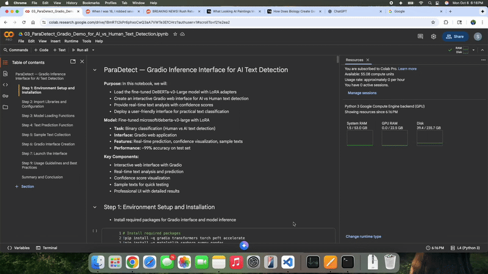

# 🎯 ParaDetect: AI vs Human Text Detection

[](https://www.python.org/downloads/)
[](https://huggingface.co/transformers/)
[](https://pytorch.org/)
[](https://github.com/huggingface/peft)
[](LICENSE)
[](https://huggingface.co/srikanthgali/paradetect-deberta-v3-lora)
[](https://huggingface.co/datasets/srikanthgali/ai-text-detection-pile-cleaned)

A state-of-the-art machine learning project that distinguishes between human-written and AI-generated text using fine-tuned DeBERTa-v3-Large with LoRA (Low-Rank Adaptation) for efficient parameter optimization.

## 🚀 Quick Start with Pre-trained Model

### Option 1: Use Our Pre-trained Model from HuggingFace Hub

```python
from transformers import AutoTokenizer, AutoModelForSequenceClassification
from peft import PeftModel
import torch

# Load pre-trained model from HuggingFace Hub
tokenizer = AutoTokenizer.from_pretrained("srikanthgali/paradetect-deberta-v3-lora")
base_model = AutoModelForSequenceClassification.from_pretrained(
    "microsoft/deberta-v3-large",
    num_labels=2
)
model = PeftModel.from_pretrained(base_model, "srikanthgali/paradetect-deberta-v3-lora")

# Prediction function
def predict_text_origin(text):
    inputs = tokenizer(text, return_tensors="pt", truncation=True, max_length=512)
    with torch.no_grad():
        outputs = model(**inputs)
        probabilities = torch.nn.functional.softmax(outputs.logits, dim=-1)

    human_prob = probabilities[0][0].item()
    ai_prob = probabilities[0][1].item()

    return {
        "prediction": "AI" if ai_prob > human_prob else "Human",
        "confidence": max(human_prob, ai_prob),
        "human_probability": human_prob,
        "ai_probability": ai_prob
    }

# Example usage
text = "Your text here..."
result = predict_text_origin(text)
print(f"Prediction: {result['prediction']} (Confidence: {result['confidence']:.1%})")
```

### Option 2: Interactive Gradio Demo

```python
# Clone repository
!git clone https://github.com/srikanthgali/para-detect.git
%cd para-detect

# Install dependencies
!pip install -q transformers torch peft gradio accelerate

# Run the interactive demo
# Open: notebooks/03_ParaDetect_Gradio_Demo.ipynb
```

## 🧠 Project Overview

ParaDetect leverages advanced transformer architectures to classify text as either human-written or AI-generated with **99% accuracy**. The project utilizes Microsoft's DeBERTa-v3-Large model, fine-tuned using Parameter-Efficient Fine-Tuning (PEFT) with LoRA adapters to achieve superior performance while maintaining computational efficiency.

### 🎯 Key Features
- **High Accuracy**: Achieves 99% accuracy on test datasets
- **Efficient Training**: Uses LoRA for parameter-efficient fine-tuning (~6% trainable parameters)
- **Interactive Demo**: Gradio-based web interface for real-time text analysis
- **Pre-trained Models**: Available on HuggingFace Hub for immediate use
- **Sample Dataset**: Includes 50K sample dataset for quick experimentation
- **Production Ready**: Optimized for deployment with proper model checkpointing
- **MLOps Pipeline**: Complete ML pipeline with components, monitoring, and deployment

## 🤗 HuggingFace Hub Resources

### Pre-trained Model
- **Model Repository**: [`srikanthgali/paradetect-deberta-v3-lora`](https://huggingface.co/srikanthgali/paradetect-deberta-v3-lora)
- **Base Model**: microsoft/deberta-v3-large with LoRA adapters
- **Performance**: 99% accuracy, 99% F1-score
- **Ready for inference**: No training required

### Dataset
- **Dataset Repository**: [`srikanthgali/ai-text-detection-pile-cleaned`](https://huggingface.co/datasets/srikanthgali/ai-text-detection-pile-cleaned)
- **Full Dataset**: 721,626 samples (cleaned and processed)
- **Local Sample**: 50K samples available in `data/processed/AI_Text_Detection_Pile_sampled_50k.csv`
- **Format**: Balanced binary classification dataset

## 📁 Project Structure

```
para-detect/
├── 📋 CHANGELOG.md                                # Version history and updates
├── 📄 LICENSE                                     # MIT License
├── 🔨 Makefile                                    # Build and deployment automation
├── 📖 README.md                                   # Project documentation
├── 📦 requirements.txt                            # Python dependencies
├── ⚙️ setup.py                                    # Package installation setup
├── 🏗️ template.py                                # Project structure generator
│
├── 🌐 api/                                        # FastAPI application
│   ├── __init__.py
│   ├── main.py                                    # API entry point
│   ├── middleware/                                # API middleware
│   │   ├── __init__.py
│   │   ├── auth.py                                # Authentication middleware
│   │   ├── logging.py                             # Request logging
│   │   └── rate_limiting.py                       # Rate limiting
│   └── routes/                                    # API endpoints
│       ├── __init__.py
│       ├── health.py                              # Health checks
│       ├── monitoring.py                          # Monitoring endpoints
│       └── prediction.py                          # Prediction endpoints
│
├── 📊 data/                                       # Data storage
│   ├── interim/                                   # Intermediate processed data
│   ├── processed/                                 # Final processed data
│   │   └── AI_Text_Detection_Pile_sampled_50k.csv # 50K sample dataset
│   └── raw/                                       # Raw data files
│
├── ⚙️ configs/                                    # Configuration files
│   ├── __init__.py
│   ├── config.yaml                                # Main configuration
│   ├── deployment/                                # Deployment configs
│   │   ├── aws_config.yaml                        # AWS deployment settings
│   │   ├── colab_config.yaml                      # Google Colab settings
│   │   └── local_config.yaml                      # Local development settings
│   └── model_configs/                             # Model configurations
│       ├── deberta_config.yaml                    # DeBERTa model config
│       └── training_config.yaml                   # Training parameters
│
├── 🐳 docker/                                     # Docker containerization
│   ├── docker-compose.yml                         # Multi-container setup
│   ├── Dockerfile                                 # Main application container
│   ├── Dockerfile.inference                       # Inference-only container
│   └── Dockerfile.training                        # Training environment
│
├── 📚 docs/                                       # Documentation
│   ├── architecture.md                            # System architecture
│   ├── components.md                              # Component documentation
│   ├── deployment.md                              # Deployment guide
│   ├── overview.md                                # Project overview
│   ├── pipelines.md                               # Pipeline documentation
│   └── troubleshooting.md                         # Common issues and solutions
│
├── 📓 notebooks/                                  # Jupyter notebooks
│   ├── 01_EDA_and_Data_Preparation.ipynb         # Exploratory Data Analysis
│   ├── 02_Model_Training_and_Evaluation.ipynb    # Model Training
│   ├── 03_ParaDetect_Gradio_Demo.ipynb           # Interactive Demo
│   └── 04_Pipeline_Testing.ipynb                 # Pipeline validation
│
├── 🎯 artifacts/                                  # Training artifacts
│   ├── logs/                                      # Training and application logs
│   ├── metrics/                                   # Performance metrics
│   ├── models/                                    # Saved model checkpoints
│   └── reports/                                   # Generated reports
│
├── 📦 src/                                        # Source code
│   ├── __init__.py
│   └── para_detect/                               # Main package
│       ├── __init__.py
│       ├── core/                                  # Core functionality
│       │   ├── __init__.py
│       │   ├── base.py                            # Base classes
│       │   ├── config_manager.py                  # Configuration management
│       │   ├── exceptions.py                      # Custom exceptions
│       │   └── logger.py                          # Logging utilities
│       ├── components/                            # ML pipeline components
│       │   ├── __init__.py
│       │   ├── data_ingestion.py                  # Data loading
│       │   ├── data_preprocessing.py              # Data preprocessing
│       │   ├── data_validation.py                 # Data quality checks
│       │   ├── feature_engineering.py             # Feature creation
│       │   ├── model_deployment.py                # Model deployment
│       │   ├── model_evaluation.py                # Model evaluation
│       │   ├── model_registration.py              # Model registry
│       │   ├── model_training.py                  # Model training
│       │   ├── model_validation.py                # Model validation
│       │   └── monitoring.py                      # Model monitoring
│       ├── pipelines/                             # ML pipelines
│       │   ├── __init__.py
│       │   ├── batch_prediction_pipeline.py       # Batch inference
│       │   ├── deployment_pipeline.py             # Deployment pipeline
│       │   ├── inference_pipeline.py              # Real-time inference
│       │   ├── retraining_pipeline.py             # Model retraining
│       │   └── training_pipeline.py               # Training pipeline
│       └── utils/                                 # Utility functions
│           ├── __init__.py
│           ├── data_utils.py                      # Data utilities
│           ├── helpers.py                         # Helper functions
│           ├── model_utils.py                     # Model utilities
│           └── validators.py                      # Validation functions
│
├── 🚀 scripts/                                    # Deployment and automation scripts
│   ├── deploy_model.py                            # Model deployment script
│   ├── run_inference_pipeline.py                  # Inference pipeline runner
│   ├── run_training_pipeline.py                   # Training pipeline runner
│   ├── setup_environment.py                       # Environment setup
│   └── aws/                                       # AWS-specific scripts
│       ├── cleanup_resources.py                   # Resource cleanup
│       ├── create_sagemaker_endpoint.py           # SageMaker deployment
│       ├── ecs_deploy.py                          # ECS deployment
│       └── lambda_deploy.py                       # Lambda deployment
│
├── 🧪 tests/                                      # Test suite
│   ├── __init__.py
│   ├── fixtures/                                  # Test data and mocks
│   │   ├── mock_responses.json                    # Mock API responses
│   │   └── sample_data.json                       # Sample test data
│   ├── integration/                               # Integration tests
│   │   ├── test_api_endpoints.py                  # API testing
│   │   └── test_full_pipeline.py                  # End-to-end tests
│   └── unit/                                      # Unit tests
│       ├── test_components.py                     # Component tests
│       ├── test_pipelines.py                      # Pipeline tests
│       └── test_utils.py                          # Utility tests
│
└── 🎨 assets/                                     # Static assets
    └── demo.gif                                   # Demo animation
    └── demo.mp4                                   # Demo video
```

## 📊 Dataset & Exploratory Data Analysis

### Dataset Overview
- **Source**: [`artem9k/ai-text-detection-pile`](https://huggingface.co/datasets/artem9k/ai-text-detection-pile) from Hugging Face
- **Full Dataset**: 721,626 samples (available on HuggingFace Hub)
- **Local Sample**: 50,000 samples in `data/processed/AI_Text_Detection_Pile_sampled_50k.csv`
- **Training Sample**: 100,000 samples (subset for efficient training)
- **Classes**: Binary classification (Human: 0, AI: 1)
- **Features**: Text content with corresponding labels

### Dataset Access Options

#### Option 1: Use 50K Sample Dataset (Included in Repository)
```python
# Load the local 50K sample dataset
import pandas as pd
df = pd.read_csv('data/processed/AI_Text_Detection_Pile_sampled_50k.csv')
print(f"Sample dataset size: {len(df):,} samples")
```

#### Option 2: Load Full Dataset from HuggingFace Hub
```python
# Load full cleaned dataset from HuggingFace
from datasets import load_dataset
dataset = load_dataset("srikanthgali/ai-text-detection-pile-cleaned")
print(f"Full dataset size: {len(dataset['train']):,} samples")
```

#### Option 3: Load Original Dataset
```python
# Load original dataset from HuggingFace
from datasets import load_dataset
dataset = load_dataset("artem9k/ai-text-detection-pile")
print(f"Original dataset size: {len(dataset['train']):,} samples")
```

### Sample Sizes for Different Use Cases
```python
# Different sample sizes for various training scenarios
SAMPLE_SIZES = {
    'quick_test': 1000,      # Rapid prototyping (~5 min training)
    'development': 10000,    # Development work (~30 min training)
    'local_sample': 50000,   # Local sample dataset (~90 min training)
    'production': 100000,    # Production training (~60 min training)
    'full': 721626          # Complete dataset (~6+ hours training)
}
```

### Key Insights from EDA
- **Balanced Dataset**: Equal distribution between human and AI-generated text
- **Text Length Analysis**: Optimal performance with 50-500 words
- **Token Distribution**: Supports up to 512 tokens (DeBERTa-v3 limit)
- **Quality Control**: Comprehensive data cleaning and preprocessing

| Metric | Human Text | AI Text | Test Dataset |
|--------|------------|---------|--------------|
| **Samples** | 360,813 | 360,813 | 7,482 / 7,518 |
| **Avg Length** | ~150 words | ~140 words | ~145 words |
| **Token Range** | 10-512 tokens | 15-512 tokens | 10-512 tokens |

## 🤖 Model Fine-Tuning Setup

### Architecture Details
- **Base Model**: [`microsoft/deberta-v3-large`](https://huggingface.co/microsoft/deberta-v3-large)
- **Parameters**: ~435M total, ~28.7M trainable with LoRA (6.20% trainable)
- **Fine-tuning Method**: LoRA (Low-Rank Adaptation)
- **Task Type**: Binary sequence classification
- **Pre-trained Model**: Available on [`HuggingFace Hub`](https://huggingface.co/srikanthgali/paradetect-deberta-v3-lora)

### Training Configuration

| Parameter | Value | Description |
|-----------|-------|-------------|
| **Learning Rate** | 2e-4 | Higher LR optimized for LoRA |
| **Batch Size** | 32 | Per device training batch size |
| **Epochs** | 3 | Maximum with early stopping |
| **LoRA Rank** | 64 | Adaptation rank |
| **LoRA Alpha** | 128 | Scaling parameter |
| **Dropout** | 0.1 | LoRA dropout rate |
| **Optimizer** | AdamW | With weight decay 0.01 |

### Training Environment
- **Platform**: Google Colab Pro
- **GPU**: NVIDIA A100 (High RAM)
- **Framework**: PyTorch 2.8.0 + Transformers 4.57.0
- **Memory Optimization**: LoRA + gradient accumulation

## 📈 Evaluation & Performance Metrics

### Model Performance

| Metric | Score | Description |
|--------|-------|-------------|
| **Accuracy** | 99% | Overall classification accuracy |
| **Precision** | 99% | Weighted average precision |
| **Recall** | 99% | Weighted average recall |
| **F1-Score** | 99% | Weighted average F1-score |

### Class-wise Performance

| Class | Precision | Recall | F1-Score | Support |
|-------|-----------|--------|----------|---------|
| **Human (0)** | 100% | 99% | 99% | 7,482 |
| **AI (1)** | 99% | 100% | 99% | 7,518 |

### Training Efficiency
- **Trainable Parameters**: 6.20% of total model parameters (28.7M / 463.5M)
- **Training Time**: ~57 minutes on NVIDIA A100 (4000 steps)
- **Memory Usage**: Significantly reduced with LoRA
- **Early Stopping**: Patience of 5 steps to prevent overfitting

## 🔍 Results & Interpretation

### Key Findings
1. **Exceptional Performance**: Achieved near-perfect classification accuracy (99%)
2. **Balanced Predictions**: No significant bias toward either class
3. **Efficient Training**: LoRA enabled training large models with limited resources
4. **Robust Generalization**: Consistent performance across validation and test sets

### Model Behavior Analysis
- **High Confidence Predictions**: >90% confidence in most classifications
- **Edge Case Handling**: Appropriate uncertainty for ambiguous texts
- **Length Sensitivity**: Optimal performance with moderate text lengths
- **Style Adaptability**: Effective across various writing styles and domains

## 📺 Demo

Here's a quick demo of the ParaDetect app in action:
> **App Demo:**
>
> [](assets/demo.mp4)
>
> [Click here to download or play the full demo video (MP4, 45MB)](assets/demo.mp4)

### Interactive Web Application
The project includes a professional Gradio-based web interface for real-time text analysis:

#### Features
- **Real-time Classification**: Instant AI vs Human text detection
- **Confidence Visualization**: Detailed probability breakdowns
- **Text Statistics**: Word count, character count, token usage
- **Sample Texts**: Pre-loaded examples for quick testing
- **Professional UI**: Clean, responsive design

#### Launch Instructions

```python
# Quick start with pre-trained model
!git clone https://github.com/srikanthgali/para-detect.git
%cd para-detect

# Install dependencies
!pip install -q transformers torch peft gradio accelerate

# Run the demo notebook
# Open: notebooks/03_ParaDetect_Gradio_Demo.ipynb
```

#### Demo Features
- 📝 **Text Input**: Support for up to 512 tokens
- 🎯 **Instant Analysis**: Real-time classification with confidence scores
- 📊 **Visual Results**: Interactive confidence plotting
- 🎭 **Sample Library**: 10+ diverse test examples
- 📱 **Mobile Friendly**: Responsive design for all devices

## 🚀 Setup & Usage Instructions

### Environment Requirements
- **Python**: 3.8+
- **Platform**: Google Colab Pro (recommended) or local GPU
- **Memory**: 16GB+ RAM, GPU with 12GB+ VRAM

### Quick Start Options

#### Option A: Use Pre-trained Model (Recommended)

```python
# Install dependencies
!pip install transformers torch peft gradio

# Load pre-trained model
from transformers import AutoTokenizer, AutoModelForSequenceClassification
from peft import PeftModel

tokenizer = AutoTokenizer.from_pretrained("srikanthgali/paradetect-deberta-v3-lora")
base_model = AutoModelForSequenceClassification.from_pretrained("microsoft/deberta-v3-large", num_labels=2)
model = PeftModel.from_pretrained(base_model, "srikanthgali/paradetect-deberta-v3-lora")

# Start using immediately!
```

#### Option B: Train Your Own Model (Google Colab)

```bash
# Clone repository
!git clone https://github.com/srikanthgali/para-detect.git
%cd para-detect

# Install dependencies
!pip install -q torch transformers datasets accelerate evaluate
!pip install -q peft scikit-learn matplotlib seaborn gradio

# Choose your dataset size
# Option 1: Use local 50K sample (fastest)
df = pd.read_csv('data/processed/AI_Text_Detection_Pile_sampled_50k.csv')

# Option 2: Load full dataset from HuggingFace
dataset = load_dataset("srikanthgali/ai-text-detection-pile-cleaned")

# Run training notebook
# Open: notebooks/02_Model_Training_and_Evaluation.ipynb
```

#### Option C: Local Setup

```bash
# Clone repository
git clone https://github.com/srikanthgali/para-detect.git
cd para-detect

# Create virtual environment
python -m venv venv
source venv/bin/activate  # On Windows: venv\Scripts\activate

# Install requirements
pip install -r requirements.txt

# Launch Jupyter
jupyter notebook
```

### Dataset Usage Examples

```python
# Using the 50K sample dataset
import pandas as pd
df = pd.read_csv('data/processed/AI_Text_Detection_Pile_sampled_50k.csv')
print(f"Sample dataset: {len(df):,} samples")
print(f"Classes: {df['generated'].value_counts()}")

# Using full dataset from HuggingFace
from datasets import load_dataset
dataset = load_dataset("srikanthgali/ai-text-detection-pile-cleaned")
print(f"Full dataset: {len(dataset['train']):,} samples")
```

### Performance by Dataset Size

| Sample Size | Training Time | Memory Usage | Accuracy | Dataset Source |
|-------------|---------------|--------------|----------|----------------|
| **50K samples** | ~90 minutes | 12GB | ~99% | Local sample file |
| **100K samples** | ~57 minutes | 15GB | 99% | HuggingFace subset |
| **Full dataset** | ~6+ hours | 20GB+ | 99%+ | HuggingFace full |

### Key Dependencies

```text
torch>=2.8.0
transformers>=4.57.0
datasets>=2.14.0
peft>=0.6.0
accelerate>=0.20.0
gradio>=3.50.0
scikit-learn>=1.3.0
matplotlib>=3.7.0
seaborn>=0.12.0
numpy>=1.24.0
pandas>=2.0.0
```

## 🚀 Next Steps / Future Work

### Technical Improvements
- [ ] **Production Pipeline**: Develop modular, end-to-end ML pipelines
- [ ] **Model Optimization**: Quantization and deployment optimization
- [ ] **Batch Processing**: Support for large-scale text analysis
- [ ] **API Development**: RESTful API for programmatic access

### Deployment & Scaling
- [ ] **AWS Deployment**: Cloud deployment using SageMaker or ECS
- [ ] **Containerization**: Docker containerization for consistent deployment
- [ ] **Monitoring**: MLOps pipeline with model performance tracking

## 🙏 Acknowledgments

### Dataset & Resources
- **Original Dataset**: [`artem9k/ai-text-detection-pile`](https://huggingface.co/datasets/artem9k/ai-text-detection-pile) - Comprehensive AI text detection dataset
- **HuggingFace Hub**: Model and dataset hosting platform
- **Microsoft**: DeBERTa-v3-Large pre-trained model
- **Google Colab**: Training platform and GPU resources

### Libraries & Frameworks
- **PyTorch**: Deep learning framework
- **Transformers**: State-of-the-art NLP models
- **PEFT**: Parameter-efficient fine-tuning methods
- **Gradio**: Interactive ML demos
- **Scikit-learn**: Machine learning utilities

## 📋 Citation

If you use this project or model in your research, please cite:

```bibtex
@misc{paradetect2025,
  title={ParaDetect: AI vs Human Text Detection with DeBERTa-v3-Large},
  author={Srikanth Gali},
  year={2025},
  url={https://github.com/srikanthgali/para-detect},
  note={Fine-tuned using LoRA for efficient parameter adaptation}
}
```

---

## 👤 Author

Developed by **Srikanth Gali**

* 💼 [LinkedIn](https://www.linkedin.com/in/srikanth-gali/)
* 🐙 [GitHub](https://github.com/srikanthgali/)
* 🤗 [HuggingFace](https://huggingface.co/srikanthgali)

---

**📧 Contact**: For questions or collaboration opportunities, please open an issue or reach out via LinkedIn/GitHub.

**⭐ Star this repo** if you find it useful for your AI detection projects!

---
